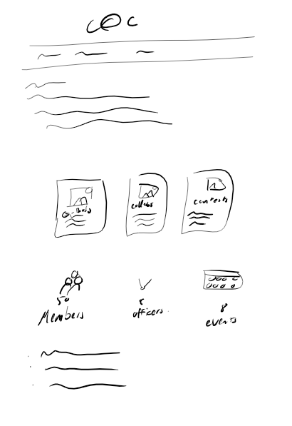
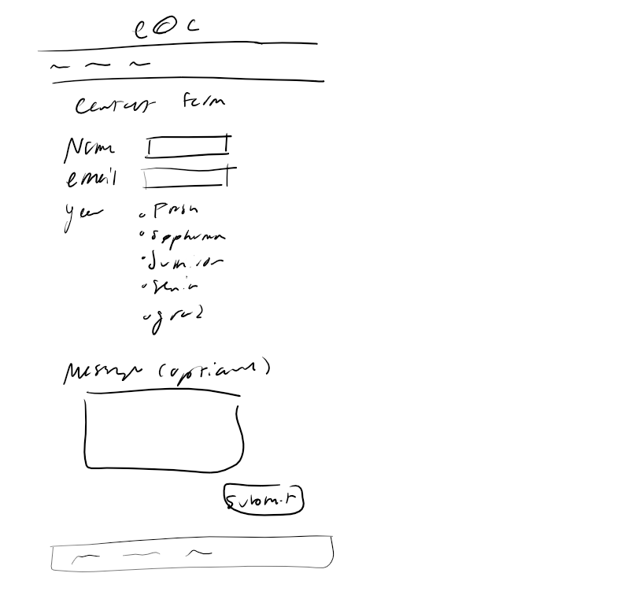
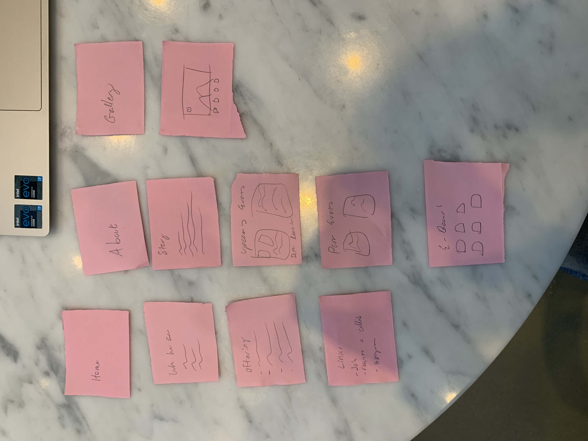
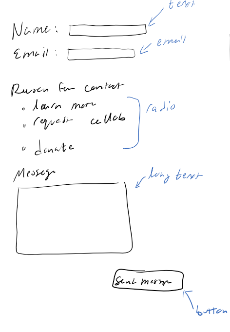
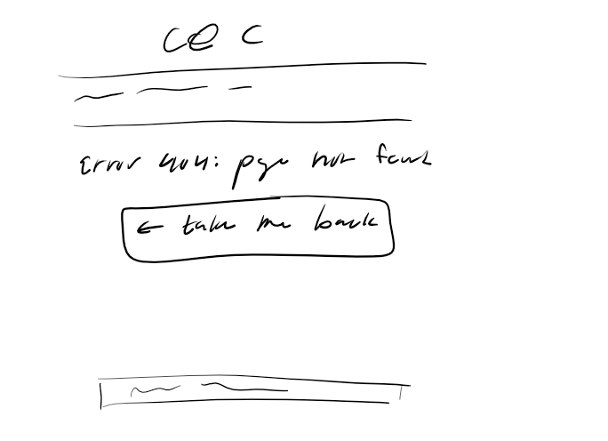
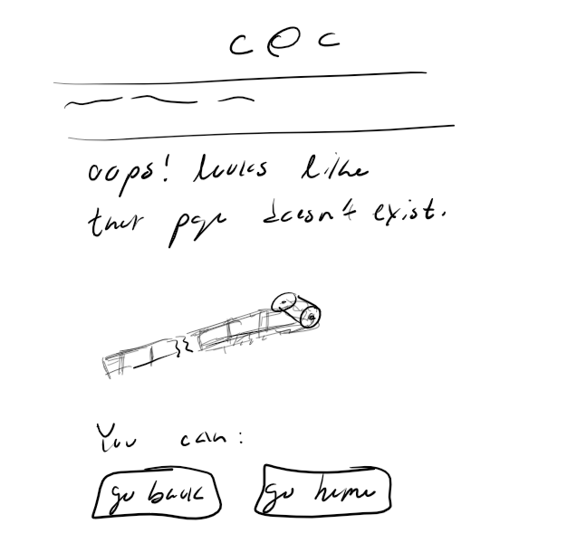

# Project 1: Design Journey

**For each milestone, complete only the sections that are labeled with that milestone.** Refine all sections before the final submission.

You are graded on your design process. If you later need to update your plan, **do not delete the original plan, leave it in place and append your new plan _below_ the original.** Then explain why you are changing your plan. Any time you update your plan, you're documenting your design process!

**Replace ALL _TODOs_ with your work.** (There should be no TODOs in the final submission.)

Be clear and concise in your writing. Bullets points are encouraged.

**Everything, including images, must be visible in _Markdown: Open Preview_.** If it's not visible in the Markdown preview, then we can't grade it. We also can't give you partial credit either. **Please make sure your design journey should is easy to read for the grader;** in Markdown preview the question _and_ answer should have a blank line between them.

## Existing Design (Milestone 1)

**Make the case for your decisions using concepts from class, as well as other design principles, theories, examples, and cases from outside of class (includes the design prerequisite for this course).**

You can use bullet points and lists, or full paragraphs, or a combo, whichever is appropriate. The writing should be solid draft quality.

### Existing Site: The Site (Milestone 1)
> What is your existing site about? Tell us about it.
This website is about the Capture at Cornell photography and videography club at Cornell.

> How and where did you create this site?

This was created for the INFO 1300 class, project 3. It was created in the span of a few weeks.

> Is this site designed for desktop, mobile devices or both?

This website is responsive and was designed for desktop and mobile devices.

> Explain with this website is a **static** website.

This website is static because it contains no ontent that changes, depsite user input or environment. It is written in HTML+CSS+JS

### Existing Site: Audience (Milestone 1)
> Briefly explain your site's audience.
> Be specific and justify why this audience is a **cohesive** group.

The audience of this site are students of Cornell and those interested in learning more about the club. This tends to be photographers and videographers, as well as members and individuals of other clubs or organizations looking to collab with our club. Site visitors likely want to learn more about the club and understand what the club has to offer. This is a cohesive group because they all have a common interest in photography and videography, and are looking to learn more about the club, and are a subset of Cornell.

### Existing Site: Audience Goals (Milestone 1)
> Document your existing site's audience's goals. (These should be informed by user research. Not assumptions or stereotypes.)
> List each goal below. There is no specific number of goals required for this, but you need enough to do the job (Hint: It's more than 1 and probably more than 2).

Goal 1: To learn more about Capture at Cornell - it's past and present offerings, what they do, if they want to join.

- **Design Ideas and Choices** _How will you meet those goals in your design?_
- The design will be a straightforward website that users can view and easily find the information they want. The site will use partials for the header and footer, and will have a navigation bar that users can use to navigate the site. There will also be an events page that can be used to view past and upcoming events, which will be dynamic.
- **Rationale & Additional Notes** _Justify your decisions; additional notes._
  - This is necessary for the essence of this website and its usefulness.

Goal 2: To join the club by filling out the quick form, or to contact the e-board.

- **Design Ideas and Choices** _How will you meet those goals in your design?_
  - The design will have a form that users can fill out to join the club, and a contact page with the e-board's emails.
- **Rationale & Additional Notes** _Justify your decisions; additional notes._
  - This will provide a quick way for users to join the club, and a way for them to contact the e-board.

Goal 3: To collab with the club by filling out the form.

- **Design Ideas and Choices** _How will you meet those goals in your design?_
  - The design will have a form that users can fill out to collab with the club.

- **Rationale & Additional Notes** _Justify your decisions; additional notes._
  - This will provide a quick way for users to request a collab with the club.

### Existing Site: Design/Sketches (Milestone 1)
> Sketch your existing site. Include these sketches here.
> **You may not copy your sketches from a previous assignment.**
> Why can't you copy the sketches? I want to get you thinking about the strengths/weaknesses of the current design.
> Provide an explanation _underneath_ each sketch explaining the sketch and any design patterns you are leveraging.
The home page will contain introductory information about the club, as well as a some images of the club. The about page will contain more information about the club, and the events page will contain a list of past and upcoming events. The contact page will contain the e-board's emails, the ability to send an email to the club in general, and a collab form.

The pages will use partials for the header, and the forms and events will be dynamic.

## Home Page

## About page

## Events Page

## Contact Page

## Milestone 1 Feedback Revisions (Milestone 2)
> Explain what you revised in response to the Milestone 1 feedback

TODO: milestone 1 feedback revisions

## Refined Design (Milestone 2)

### Refined Design: Persona (Milestone 2)
> Use the goals you identified above from your prior user research to develop a persona of your site's audience.
> Your persona must have a name and a face. The face can be a photo of a face or a drawing, etc.
> You may type out the persona below with bullet points or include an image of the persona. Just make sure it's easy to read the persona when previewing markdown.

# Ferdinando Flores

*Image sourced from <https://thispersondoesnotexist.com/>, produced by GAN (generative adversarial network) StyleGAN2*

Ferdinando Flores is a Junior Cornellian and studies Computer Science. They hate being called "Ferd," even though everyone calls them that. Despite their studies, Ferd actually has a passion for photography and hopes to pursue it after school. Ferd knows nothing about photography. Against the advice of their parents, friends, and faculty, they have decided to spend a lot of money on new equipment that they do not know how to use, but would like to learn. They have heard about Capture at Cornell and would like to learn more about the club and how they can join.

- Has photography equipment
- Needs to learn how to use it
- Needs to find a community to learn from
- Needs opportunities to practice photography
- Needs to stop being called "Ferd"
- Obstacle: disapproving parents

### Refined Design: Mobile or Desktop (Milestone 2)
> Will your refined design be functional on mobile, tablet, or desktop devices?

Ferd, being the typical upper-middle class Cornellian, has a desktop PC, a laptop, an iPad, an iPhone, as well as a Kindle (which they bought at a Fourth of July sale hoping to get into reading, but never did). Ming, also a typical Cornellian, does not have time to design for every platform. The website will be redesigned will be for desktop.

### Refined Design: Form Brainstorm (Milestone 2)
> Brainstorm ideas for collecting data from your persona on your website.
> The form must support the persona's goals when using the website.
> For each form idea, explain how the form supports the goals of the persona.
> **Refer to the persona by name.**

- A form to collect information about the Ferd's photography equipment and experience, so that the club can understand Ferd better and cater towards them.
    - - Ferd wants to learn how to use their new photography equipment, and has no experience with photography. The club can host events that help Ferd learn how to use their equipment.
- A form to collect information about the user's photography interests, so that the club can help them find opportunities to practice photography.
    - - Ferd wants to find opportunities to practice photography, and the club can help them do that.
- A form for Ferd to submit their photos. This helps Ferd to learn and grow together with the club.

### Refined Design: Content (Milestone 2)
> List **all** the content you plan to include your website for your **persona**.
> You should list all types of content you planned to include (i.e. text, photos, images, etc.)
> List the content here. Label the content as "(new)" if it's new to the existing site.

1. A gallery of photos of the club's work so Ferd can see the club's work.
2. A list of upcoming events so Ferd can see what events the club is hosting.
3. A form for Ferd to fill out so they may submit their own work.

### Refined Design: Content Justification (Milestone 2)
> Explain why this content supports the goals of your persona.
> **Refer to the persona by name.**

This will help Ferd to not only see the activity of the club, but also become involved with it.

### Refined Design: Content Organization (Milestone 2)
> Organize the content for the audience and identify possible pages for the content using **multiple iterations** of card sorting.
> Include photographic evidence of each iteration of card sorting **and** a explanation of your thought process for each iteration.
> **Please physically sort cards;** please don't try and do this digitally.
> **Refer to the persona by name.**

### Refined Design: Navigation (Milestone 2)
> Please list the pages you will include in your website's navigation.

- Home
- About
- Events
- Gallery

> Explain why the names of these pages make sense for your persona.

This helps Ferd to find the information they need quickly and easily in few pages.

### Refined Design: Design (Milestone 2)
> Refine the design of your site to address the goals of your persona.
> Include iterations of **sketches** for each page of the refined design.
> Provide a brief explanation _underneath_ each sketch.
> Document your _entire_ design process. **Show your preliminary sketches and your final sketches.** **We want to see iteration!**
> **Refer to your persona by name in each explanation.**

Ferd can see the basics of the club. They can learn what we have to offer, and how to contact us.

This is a revision of the home page. It includes a header, footer, and a main content section. Instead of the outdate carousel, there are three cards advertising what the club has to offer.

Ferd can learn more about the history of the club and the eboard.

Ferd can find upcoming events and past ones, to see if this what they are interested in and plan out their schedule.

Ferd can fill out a form to contact the club. They input their name, email, and an optional message.

Ferd can find the work of the club in a gallery format.

This first iteration was a simple design that included a header, footer, and a main content section. There's a home, about, event, and a gallery page. This design is the most spread

This second iteration was a more compact design that included a header, footer, and a main content section. There's a home, about, event, and no gallery page.

This third iteration has even less content and isn't too helpful for ferd.

### Partial Plan (Milestone 2)
> Using your refined sketches, plan your site's partials.
> You may describe each partial or sketch it. It's up to you!
> Explain how you will customize at least 1 partial.

There will be a header and footer partial.
The header will be the same as the current website's header. It contains the logo, and a simple nav bar to navigate to the different pages.

The footer will be customized to include links to the club's social media pages and contact information, as well as a link to join via campusgroups.

## Milestone 2 Feedback Revisions (Milestone 3)
> Explain what you revised in response to the Milestone 2 feedback

I better used the persona to justify my design decisions. I also added designs for the 404 page and the confirmation page. I removed the gallery page, as Ferd can easily find our work on our social media pages.

## Form Design and Planning (Milestone 3)

### Refined Form Design (Milestone 3)
> Refine the design of your site's form to address the goals of your persona.
> Include iterations of **sketches** of the form and its confirmation message.
> Provide a brief explanation _underneath_ each sketch.
> **Refer to the persona by name.**

This contact page allows Ferd to reach out to the club. They put their name and email in, select their reason for contact, and may input an optional message. They can then submit the form, and be directed to a confirmation page.

This confirmation page lets Ferd know that their message has been sent. It repeats the information that Ferd sent to the club and thanks them.

### Form Planning (Milestone 3)
> Will your form use a GET or POST request.
> Justify your decision as to why the request type is appropriate for the form.

This form will use post, as it is sending information to the server. This allows Ferd to see their information in the confirmation, and for the club to see the form .

## Milestone 3 Feedback Revisions (Final Submission)
> Explain what you revised in response to the Milestone 3 feedback

TODO: milestone 3 feedback revisions

## Complete & Polished Website (Final Submission)

### Routing (Final Submission)
> Plan your HTTP routing.
> List each route and the PHP file for each route.

| Route       | PHP File                            |
| ----------- | ----------------------------------- |
/ --> pages/home.php
/about --> pages/about.php
/contact --> pages/contact.php
/join --> pages/join.php
/events --> pages/events.php

> Explain why these routes (URLs) are usable for your persona.

These routes are succinct and descriptive of the content on the page. Ferd can easily remember and type out these names to go directly to that pages.

### Refined Missing Resource Page (Milestone 3)
> Refine the design of your site's missing resource 404 page for your persona.
> Include iterations of **sketches** of the page.
> Provide a brief explanation _underneath_ each sketch.
> **Refer to the persona by name.**

If Ferd tries to go to a page that doesn't exist, or types in the wrong URL, they will be directed to a 404 page. This is a draft.

This 404 page let's Ferd know that the page they are looking for doesn't exist. It gives them the option to escape by either going to the previous page or going home. Ferd can also just use the nav bar as usual. This page is better as it gives two options to escape and has a nice design.

### Accessibility Audit (Final Submission)
> Tell us what issues you discovered during your accessibility audit.
> What do you do to improve the accessibility of your site?

TODO: audit fixes

### Final Design + Audience Goals (Final Submission)
> Tell us how your final site addresses the gaols of the audience.
> Be specific. Tell us how you tailored your design, content, etc. to make your website usable for your persona.
> **Refer to the persona by name.**

TODO: rationale

### Self-Reflection (Final Submission)
> Take some time here to reflect on how much you've learned since you started this class. It's often easy to ignore our own progress. Take a moment and think about your accomplishments in this class. Hopefully you'll recognize that you've accomplished a lot and that you should be very proud of those accomplishments!

TODO: self-reflection

## Grading (Final Submission)

### Grading: Mobile or Desktop (Final Submission)
> When we grade your final site, should we grade this with a mobile screen size or a desktop screen size?

TODO: screen size

### Grading: Partials (Final Submission)
> Clearly list each partial file and where you used it.

- TODO: partial 1
- TODO: partial 2

> Which partials have customization? Explain how the customization looks in the browser.

- Example: header.php shows a border around the current page (TODO: delete this line)
- TODO: partial customization

### Collaborators
> List any persons you collaborated with on this project.

TODO: list your collaborators

### Reference Resources
> Please cite any external resources you referenced in the creation of your project.
> (i.e. W3Schools, StackOverflow, Mozilla, etc.)

TODO: list reference resources
